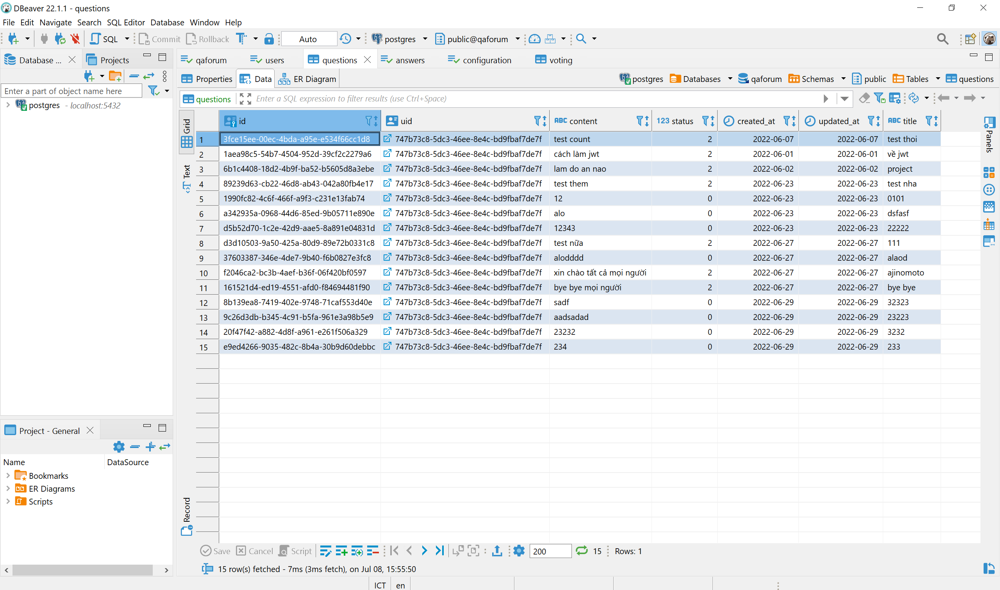

# LAB ASSIGNMENT 2

Course `CSC13002`: INTRODUCTION TO SOFTWARE ENGINEERING
Class 20CLC11 Term III / 2022-2023

StudentID: `20127530`
FullName: `Nguyễn Đinh Quang Khánh`
Role code: `Backend developer`
Framework: `Express`
Tutorial link: [`Node.js Crash Course Tutorial`](https://www.youtube.com/playlist?list=PL4cUxeGkcC9jsz4LDYc6kv3ymONOKxwBU)

In this project my team will use `Express` which is a minimal and flexible `Node.js` web application framework that provides a robust set of features for web and mobile applications.

**Table of contents**

- [LAB ASSIGNMENT 2](#lab-assignment-2)
  - [GET LIST OF PENDING QUESTIONS API](#get-list-of-pending-questions-api)
    - [Implementing](#implementing)
    - [Testing](#testing)
  - [GET LIST OF USERS API](#get-list-of-users-api)
    - [Implementing](#implementing-1)
    - [Testing](#testing-1)
  - [GET LIST OF LATEST QUESTIONS API](#get-list-of-latest-questions-api)
    - [Implementing](#implementing-2)
    - [Testing](#testing-2)

## GET LIST OF PENDING QUESTIONS API

### Implementing

- File path: `backend/src/routes/v1/admin.route.js`.
This is file that implements the `GET` request for the list of pending questions.

```js
const express = require('express');
const validate = require('../../middlewares/validate');
const adminValidation = require('../../validations/admin.validation');
const adminController = require('../../controllers/admin.controller');
const auth = require('../../middlewares/auth');

const router = express.Router();

// Get list of pending questions route
router
  .route('/manage-questions/:page/:limit')
  .get(auth('getPendingQuestions'), validate(adminValidation.getPendingQuestions), adminController.getPendingQuestions);

module.exports = router;
```

- File path: `backend/src/middlewares/auth.js`
JWT token for authentication

```js
const passport = require('passport');
const httpStatus = require('http-status');
const ApiError = require('../utils/ApiError');
const { roleRights } = require('../config/roles');

const auth = (...requiredRights) => async (req, res, next) => {
  return new Promise((resolve, reject) => {
    passport.authenticate('jwt', { session: false }, verifyCallback(req, resolve, reject, requiredRights))(req, res, next);
  })
    .then(() => next())
    .catch((err) => next(err));
};

module.exports = auth;
```

- File path: `backend/src/validations/admin.validation.js`
Validation for `page` and `limit` of list of pending questions.

```js
const Joi = require('joi');

const getPendingQuestions = {
  params: Joi.object().keys({
    page: Joi.number().required(),
    limit: Joi.number().required(),
  }),
};
```

- File path: `backend/src/controllers/admin.controller.js`
Controllers for `page` and `limit` of list of pending questions

```js
const catchAsync = require('../utils/catchAsync');
const { adminService } = require('../services');

const getPendingQuestions = catchAsync(async (req, res) => {
  const result = await adminService.getPendingQuestions(req.params.page, req.params.limit);
  res.send(result);
});
module.exports = { getPendingQuestions };
```

- File path: `backend/src/services/admin.service.js`
Services to get list of pending questions and number of pending questions.

```js
const catchAsync = require('../utils/catchAsync');
const { adminService } = require('../services');

const getPendingQuestions = async (page, limit) => {
  const listPendingQuestions = await prisma.questions.findMany({
    skip: page * limit,
    take: limit,
    where: {
      status: 0,
    },
    orderBy: {
      updated_at: 'desc',
    },
  });
  const countPendingQuestions = await prisma.questions.count({
    where: {
      status: 0,
    },
  });
  return { count: countPendingQuestions, data: listPendingQuestions };
};
module.exports = { getPendingQuestions };
```

### Testing

This is my question relation data in Q&A Forum database.


Send a GET request to path: `http://localhost:3000/v1/admin/manage-questions/:page/:limit` and pass params page = 0 and limit = 5 in and get the result in the below space.


## GET LIST OF USERS API

### Implementing

- File path: `backend/src/routes/v1/admin.route.js`.
This is file that implements the `GET` request for the list of users.

```js
const express = require('express');
const validate = require('../../middlewares/validate');
const adminValidation = require('../../validations/admin.validation');
const adminController = require('../../controllers/admin.controller');
const auth = require('../../middlewares/auth');

const router = express.Router();

// Get list of users route
router.route('/list-users/:page/:limit').get(auth('getUsers'), validate(adminValidation.getUsers), adminController.getUsers);
module.exports = router;
```

- File path: `backend/src/middlewares/auth.js`
JWT token for authentication

```js
const passport = require('passport');
const httpStatus = require('http-status');
const ApiError = require('../utils/ApiError');
const { roleRights } = require('../config/roles');

const auth = (...requiredRights) => async (req, res, next) => {
  return new Promise((resolve, reject) => {
    passport.authenticate('jwt', { session: false }, verifyCallback(req, resolve, reject, requiredRights))(req, res, next);
  })
    .then(() => next())
    .catch((err) => next(err));
};

module.exports = auth;
```

- File path: `backend/src/validations/admin.validation.js`
Validation for `page` and `limit` of list of users.

```js
const Joi = require('joi');

const getUsers = {
  params: Joi.object().keys({
    page: Joi.number().required(),
    limit: Joi.number().required(),
  }),
};
```

- File path: `backend/src/controllers/admin.controller.js`
Controllers for `page` and `limit` of list of users

```js
const catchAsync = require('../utils/catchAsync');
const { adminService } = require('../services');

const getUsers = catchAsync(async (req, res) => {
  const result = await adminService.getUsers(req.params.page, req.params.limit);
  res.send(result);
});
module.exports = { getUsers };
```

- File path: `backend/src/services/admin.service.js`
Services to get list of questions in feed and number of pending questions.

```js
const catchAsync = require('../utils/catchAsync');
const { adminService } = require('../services');

const getUsers = async (page, limit) => {
  const listUsers = await prisma.users.findMany({
    skip: page * limit,
    take: limit,
    select: {
      id: true,
      username: true,
      profilepictureurl: true,
      role: true,
      name: true,
      disabled: true,
    },
  });
  const countUsers = await prisma.users.count();
  return { count: countUsers, data: listUsers };
};

const listConfigurations = async () => {
  const Configurations = await prisma.configuration.findMany({
    select: {
      slug: true,
      value: true,
    },
  });
  return Configurations;
};
module.exports = { getUsers };
```

### Testing

This is my user relation data in Q&A Forum database.


Send a GET request to path: `http://localhost:3000/v1/admin/list-users/:page/:limit` and pass params page = 0 and limit = 5 in and get the result in the below space.


## GET LIST OF LATEST QUESTIONS API

### Implementing

- File path: `backend/src/routes/v1/question.route.js`.
This is file that implements the `GET` request for the list of latest questions.

```js
const express = require('express');
const auth = require('../../middlewares/auth');
const validate = require('../../middlewares/validate');
const questionValidation = require('../../validations/question.validation');

const questionControlller = require('../../controllers/question.controller');

const route = express.Router();

// Get list of latest questions route
route
  .route('/feed/:page')
  .get(auth('getLatestFeed'), validate(questionValidation.getLatestFeed), questionControlller.getLatestFeed);
module.exports = router;
```

- File path: `backend/src/middlewares/auth.js`
JWT token for authentication

```js
const passport = require('passport');
const httpStatus = require('http-status');
const ApiError = require('../utils/ApiError');
const { roleRights } = require('../config/roles');

const auth = (...requiredRights) => async (req, res, next) => {
  return new Promise((resolve, reject) => {
    passport.authenticate('jwt', { session: false }, verifyCallback(req, resolve, reject, requiredRights))(req, res, next);
  })
    .then(() => next())
    .catch((err) => next(err));
};

module.exports = auth;
```

- File path: `backend/src/validations/question.validation.js`
Validation for `page` and `limit` of list of latest questions.

```js
const Joi = require('joi');

const getLatestFeed = {
  params: Joi.object().keys({
    page: Joi.number().required(),
  }),
};
```

- File path: `backend/src/controllers/question.controller.js`
Controllers for `page` and `limit` of list of latest questions.

```js
const httpStatus = require('http-status');
const catchAsync = require('../utils/catchAsync');
const ApiError = require('../utils/ApiError');
const questionService = require('../services/question.service');

const getLatestFeed = catchAsync(async (req, res) => {
  const latestFeed = await questionService.getLatestFeed(req.params.page);
  res.send(latestFeed);
});
module.exports = { getLatestFeed };
```

### Testing

This is my question relation data in Q&A Forum database.


Send a GET request to path: `http://localhost:3000/v1/question/feed/:page` and pass params page = 0 in and get the result in the below space.

